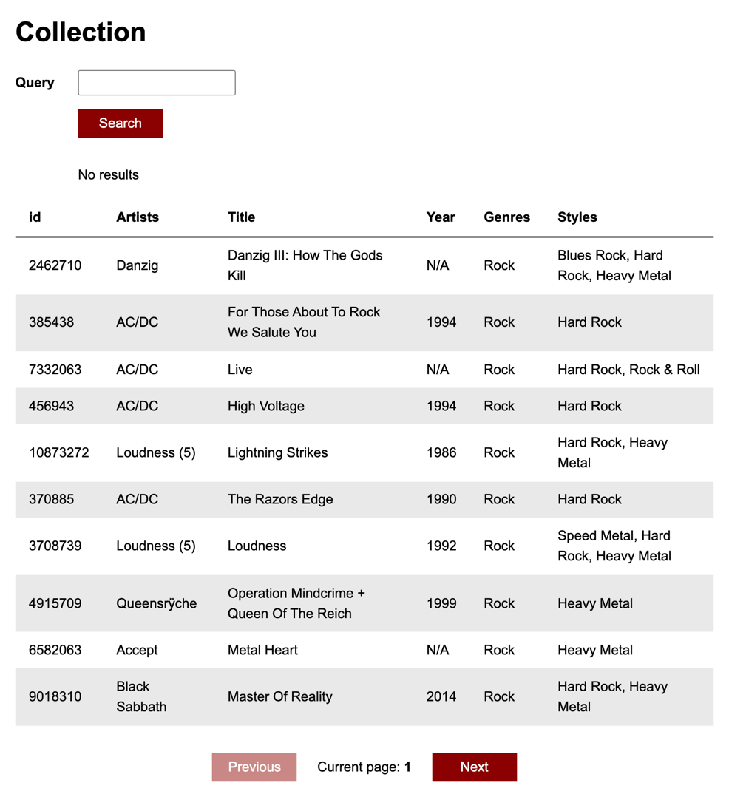

Instalirati NodeJS i NPM
https://nodejs.org/en/

Provjeriti radi li NPM u terminalu (command prompt-u)

```
npm -v
```

Mora vratiti neku verziju, npr "7.18.1".

## 1. Instalacija projekta (samo jednom)

U terminalu otvoriti (navigirati) do datoteke `cd naziv-datoteke` i pokrenuti

```
npm install
```

## 2. Pokretanje projekta

U terminalu otvoriti (navigirati) do datoteke `cd naziv-datoteke` i pokrenuti

```
npm run start
```

# Zadatak

## 1. dan

1. Preuzeti datoteku sa repozitorija (download zip), instalirati i pokrenuti projekt

2. Napraviti sljedeće komponente u `src/components` folderu:

   SearchForm - za formu (input i button)
   CollectionTable - za tablicu sa podacima. Tablica mora imati `thead` sa `tr` i `th` zaglavljima i `tbody`. `tr` i `td` markup će se nalaziti u `TableItem` komponenti.
   TableItem - jedan podatkovni redak tablice (tr u tbody elementu)
   Pagination - paginacija (previous i next button i trenutni page)

3. Dodati HTML markup za komponente

4. Pozvati komponente u src/App.js

5. U `src/App.jsx` je importan `data` iz `src/data.json` kojeg danas koristite kao placeholder podatke. Sutra radimo API integraciju.

6. Prosljediti placeholder podatke komponentama putem props-a.

SearchForm - prima standardni React "children" prop koji će sadržavati rezultat pretraživanja. U suprotnom će ispisati "No results".

CollectionTable - prima standardni React "children" prop koji će sadržavati podatkovne retke koji se iterativno pozivaju ovisno o `releases` array-u podataka iz `data.json` datoteke.

TableItem - prima propove za prikaz podataka iz `releases` array-a `data.json` datoteke.

Pagination - prima propove za prikaz podataka iz `pagination` objekta `data.json` datoteke. Potrebni su `pages` koji sadrži ukupan broj pageva i `page` koji sadrži podatak koji je trenutni page.

7. Dodati stilove u `src/index.css` da aplikacija izgleda što bliže screenshotu ili proizvoljno



### Bonus zadaci

1. U `public/index.html` promjeniti <title> vrijednost na vaše ime i prezime i naziv projekta

2. U `public/index.html` dodati <link> element sa CSS linkom na `normalize.css` koji služi za izjednačavanje stilova između browsera. Ukoliko je dobro dodan, font u projektu bi se trebao promjeniti na Arial. https://cdnjs.com/libraries/normalize

### Korisne informacije

Tablice
https://www.w3schools.com/html/html_tables.asp

Input
https://www.w3schools.com/tags/tag_input.asp

Button
https://www.w3schools.com/tags/tag_button.asp

Prijedlog strukture `App` komponente sa komponentama

```jsx
  return (
    <div>
      <header>
        {/* Dopuniti sa odgovarajućim HTML markupom i tekstom */>}
      </header>
      <SearchForm>{/* Dopuniti sa propsima */>}</SearchForm>
      <CollectionTable>
        {/* Dopuniti da se iterativno stvaraju TableItem komponente */>}
        <TableItem {/* Dopuniti sa propsima */>} />
      </CollectionTable>

      <Pagination {/* Dopuniti sa propsima */>} />
    </div>
  );
```

## 2. dan
